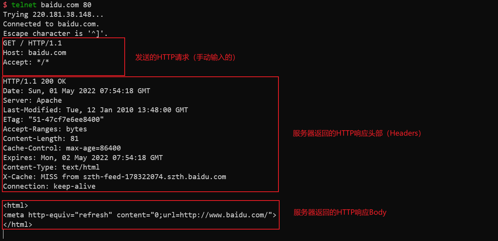

## 前言

众所周知，HTTP（超文本传输协议）是基于TCP的应用层协议，并且在2.0以前的版本，HTTP的头部是文本，因此编程与调试都是比较简单的。使用C++发送HTTP的请求主要分为以下几步：

- 建立socket连接
- 发送HTTP请求
- 接收响应

## 建立socket连接

### 创建socket

使用库函数`socket`来创建一个socket。

```cpp
// PF_INET: IPv4, SOCK_STREAM: TCP
int sock = ::socket(PF_INET, SOCK_STREAM, 0);
```

### 指定socket目的地址

我们需要一个存储结构`sockaddr_in`来保存远程主机的IP地址和端口号。
    
```cpp
struct sockaddr_in servAddr;
std::memset(&servAddr, 0, sizeof(servAddr));
// 指定为IPv4协议
servAddr.sin_family = AF_INET;
// 指定远程主机的IP地址
servAddr.sin_addr.s_addr = ::inet_addr(inet_ntoa(*(struct in_addr *)servIP->h_addr_list[0]));
// 指定远程主机的端口号（默认为80）
servAddr.sin_port = ::htons(80);
```

注意，以上代码中设置远程主机IP地址的时候，我们一般不直接指定IP，而是通过域名来查询。根据域名可以使用`gethostbyname`函数来获取IP地址。

```cpp
auto servIP = ::gethostbyname(host.c_str());
```

### 建立socket连接

确定好远程地址后，我们使用`connect`函数来建立socket连接。

```cpp
auto err = ::connect(sock, (struct sockaddr *)&servAddr, sizeof(servAddr));
if (err != 0) {
    ::perror("Connection Error: ");
}
```

至此，我们就建立了一个socket连接。完整代码（HTTPConnection.cpp）：

```cpp
bool HTTPConnection::connect(const std::string &host) {
    if (socks.find(host) != socks.end())
        return true;

    int sock = ::socket(PF_INET, SOCK_STREAM, 0);
    auto servIP = ::gethostbyname(host.c_str());

    struct sockaddr_in servAddr;
    std::memset(&servAddr, 0, sizeof(servAddr));
    servAddr.sin_family = AF_INET;
    servAddr.sin_addr.s_addr = ::inet_addr(inet_ntoa(*(struct in_addr *)servIP->h_addr_list[0]));
    servAddr.sin_port = ::htons(80);

    auto err = ::connect(sock, (struct sockaddr *)&servAddr, sizeof(servAddr));
    if (err != 0) {
        // std::cout << "connect error: " << err << std::endl;
        ::perror("Connection Error: ");
        // std::cout << "Error no: " << errno << std::endl;
        return false;
    }
    socks[host] = sock;
    return true;
}
```

## 发送HTTP请求

我们先使用telnet来测试一下HTTP请求的格式。如下图所示：



我们可以看到，HTTP请求的格式是这样的：

```
[method] [requested path] [http version]\r\n
[header key]: [header value]\r\n
[header key]: [header value]\r\n
\r\n
```

而HTTP响应的格式是这样的：

```
[http version] [http status code] [http status code explaination]\r\n
[header key]: [header value]\r\n
[header key]: [header value]\r\n
\r\n
[body]
```


我们只需要把请求的方法（下载文件一般为GET）、请求的路径（依文件url而定）、HTTP版本（暂定为HTTP/1.1）和HTTP头部组装起来，然后通过socket发送即可。

```cpp
std::string constructHeaders(const std::string &path, const std::string &method) {
    std::stringstream ss;
    // 组装HTTP请求第一行
    ss << method << " " << path << " HTTP/1.1\r\n";
    // 组装头部
    for (const auto &[k, v] : headers) {
        ss << k << ": " << v << "\r\n";
    }
    // 写入一个空行
    ss << "\r\n";
    return ss.str();
}
// 组装头部
auto req = constructHeaders(path, "HEAD");
// 然后通过socket发送
::send(socks[host], req.c_str(), req.length(), 0);
```
