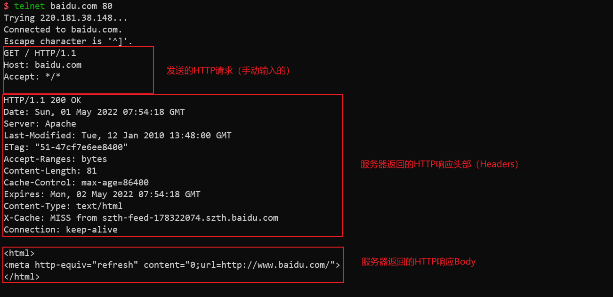

## 多线程下载原理

HTTP协议允许我们只请求资源的一部分，只需要在请求头中添加Range字段即可。格式如下：

```plain
Range: bytes=0-1023
```

这表示我们只需要请求该资源的0-1023字节（两边都是闭区间）。因此，对于我们需要下载的文件，我们可以开多个线程，分别请求文件的一部分，最后再将所有部分合并起来，就可以得到完整的文件。

## 检查服务器是否支持Range请求

在下载之前，我们需要知道服务器是否支持Range请求，如果不支持，我们就不能多线程下载了。为此，我们可以先发送一个HEAD请求，检查服务器是否支持Range请求。如果服务器支持，则会在请求头中返回`Accept-Ranges: bytes`。同时我们可以通过HEAD请求知道文件的大小，进而确定每个线程下载的范围。



如上图，在响应头中包含了如下内容，说明服务器支持Range请求，并且此文件大小为81字节。

```
Accept-Ranges: bytes
Content-Length: 81
```

## 开启多个线程并行下载

确定好文件大小`fileSize`与线程数`threadCount`后，则每个线程需要下载`perThreadSize = fileSize / threadCount`字节的数据。前`remain = fileSize % threadCount`个线程需要多下载一个字节。

```c++
// 这个函数负责下载文件的一个范围
void downloadRange(const string &url, size_t beginPos, size_t endPos) {
    multi_get::HTTPConnection conn{};
    std::stringstream ss;
    ss << "bytes=" << beginPos << '-' << endPos;
    // 设置请求范围
    conn.setHeader("Range", ss.str());
    auto res = conn.get(url);

    string filename = url.substr(url.find_last_of('/') + 1);

    ss.str("");
    ss << '.' << beginPos << '-' << endPos;
    filename.append(ss.str());

    ofstream out(filename);
    out.write(res.body().data(), res.body().size());
    out.close();

    lock_guard<std::mutex> locker(m);
    std::cout << "Thread " << this_thread::get_id() << " downloaded " << res.contentLength() << " bytes" << std::endl;
}

int perThreadSize = fileSize / threadCount;
int remain = fileSize % threadCount;
int idx = -1;

vector<std::thread> threads(threadCount);
vector<pair<size_t, size_t>> ranges; // 每个线程下载的范围
for (int i = 0; i < threadCount; ++i) {
    int range = perThreadSize;
    if (remain-- > 0)
        ++range;
    ranges.emplace_back(idx + 1, idx + range);
    threads[i] = std::thread{downloadRange, url, idx + 1, idx + range};
    idx += range;
}

for (int i = 0; i < threadCount; ++i) {
    threads[i].join();
}
```

## 合并文件

每个线程下载的文件内容都被保存在一个临时文件中，文件名为`[filename].rangeBegin-rangeEnd`，其中`rangeBegin`为线程的起始字节位置，`rangeEnd`为线程的结束字节位置。我们将所有文件合并到一个文件中，文件名为`filename`，并删除临时文件。

```c++
ofstream output;
stringstream ss;
ss << filename << '.' << ranges[0].first << '-' << ranges[0].second;
// 第一个线程下载的文件
output.open(ss.str(), std::ios::binary | std::ios::out | std::ios::app);
// 遍历其他线程下载的文件
for (int i = 1; i < ranges.size(); ++i) {
    stringstream ss;
    ss << filename << '.' << ranges[i].first << '-' << ranges[i].second;
    ifstream input;
    input.open(ss.str(), std::ios::binary | std::ios::in);
    // 将这个文件的内容追加到第一个线程下载的文件末尾
    output << input.rdbuf();
    input.close();
    filesystem::remove(ss.str());
}
output.close();
// 重命名文件
filesystem::rename(ss.str(), filename);
```